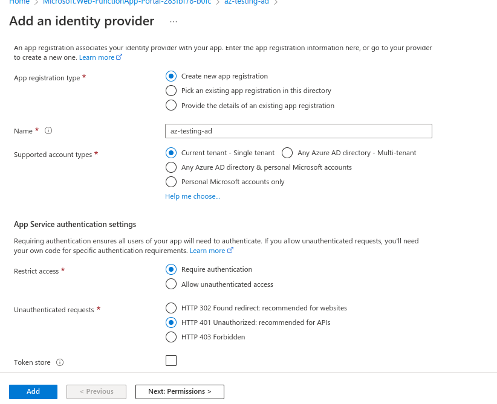

# Azure API Management management API shared access signature (SAS) generator

## Deployment
The deployment is done through github actions. The following variables should be added to the github secrets:
* `AZURE_FUNCTIONAPP_NAME_DEV`, the name of the dev function service
* `AZURE_FUNCTIONAPP_NAME_PROD`, the name of the prod function service
* `AZURE_FUNCTIONAPP_PUBLISH_PROFILE_DEV`, the dev function's publish profile that can be fetched from the function app's overview
* `AZURE_FUNCTIONAPP_PUBLISH_PROFILE_PROD`, the prod function's publish profile that can be fetched from the function app's overview

## Configuring Azure AD app registrations
The service needs at least two app registrations in Azure AD to work. One for the function app and one for each client that is calling the API.

### Service app registration
The app registration for the function app can be created from the Azure function. It happens by enabling authentication with the Microsoft Identity Platform provider. The following settings are suitable, permissions tab does not need to be edited:

Once the app registration is created, an app role needs to be added for it. The app role should be configured to be for applications, the value can be chosen to be whatever but the format usually is Subject.Verb, for example ManagementAPI.Read. The role needs to be enabled. The value is then added to the function app's configuration as an application setting. The name should be ROLE_PERMISSION and the value is the role's value.

### Client app registration
The client app should be created from the app registration section of the Azure AD. It should be in organizational directory only and no redirect URL is needed. Once it's created, from the API permissions tab of the registration, click `Add permission`. There select the service app registration from `my APIs` section and under its application permissions there should be the role that was created for it. Select it and it needs to be authorized by someone who has enough rights (it requires more privileges than any other step here). It can be done from the same view by clicking `Grant admin consent for <directory>`.

The application that calls this API needs to configure the application to fetch a token from the AD endpoint. To fetch the token, one can use Microsoft authentication library. [Here are some instructions for it](https://docs.microsoft.com/en-us/azure/active-directory/develop/scenario-daemon-app-configuration?tabs=dotnet). For it to work, we need to create a secret for the client. It can be created from the `Certificates & secrets` tab in the Azure portal. We need both the secret's value and the secret id. Additionally, we need to fetch the Application (client) ID from the client registration's overview, and tenant ID and application ID URI from the service registration's overview page. Note, the secret has an expiration date so new secret needs to be created once in a while.

## Delegation key
This function needs either the primary or the secondary key from the API management's Management API tab in Azure portal. It should be added to the function app's configuration as an application setting. The name should be KEY. 
